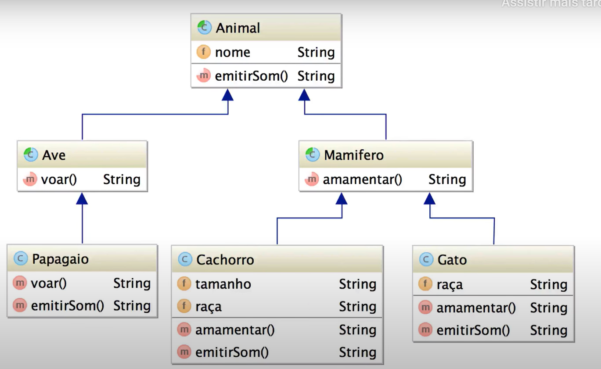
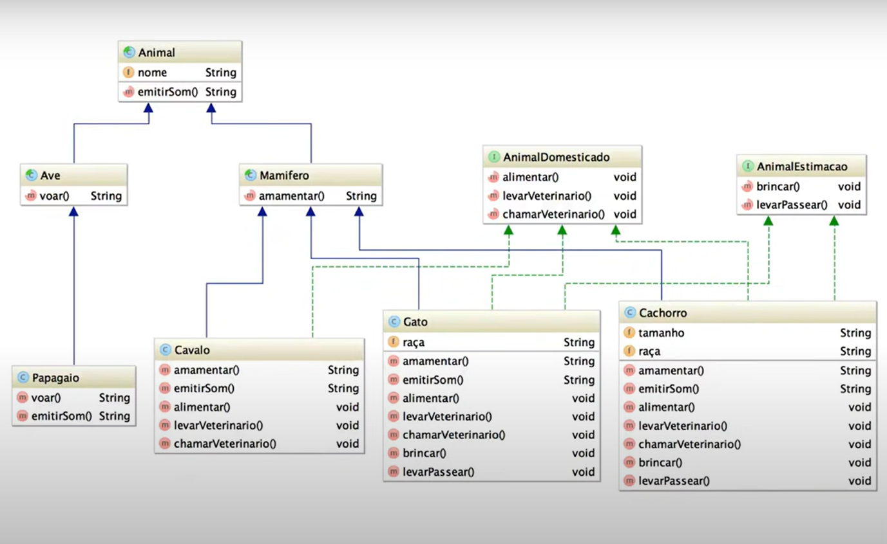
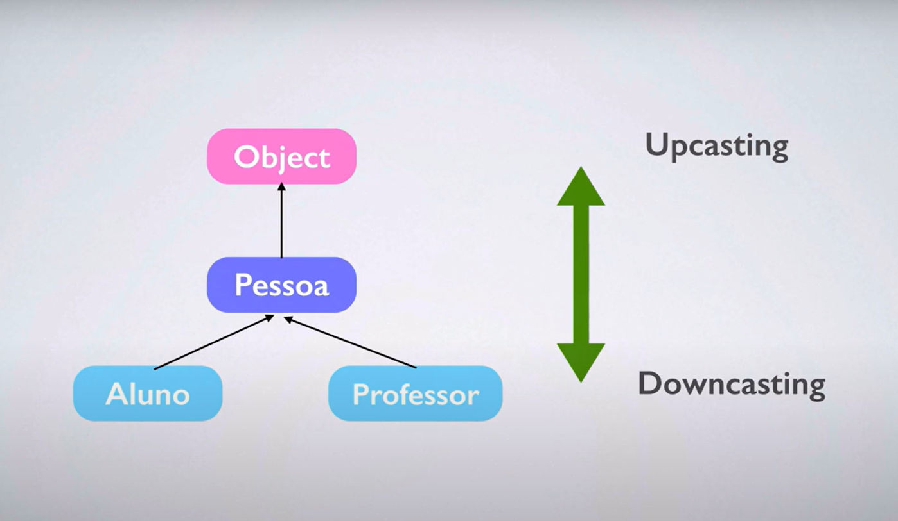
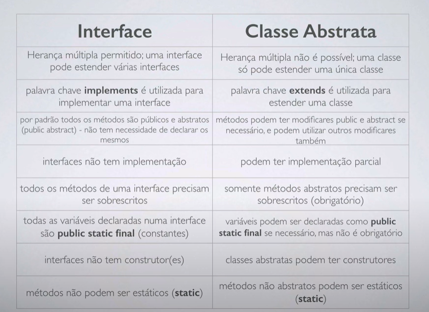

# Aula 07. Heranca

## Herança 
[Vídeo Aula](https://youtu.be/MOXLCjL4Ik4)
- Herança, vamos criar duas classes
	- Aluno
		- nome
		- endereco
		- telefone
		- cpf
		- cursos
		- notas
		- calcularMedia
		- verificarAprovado
	- Professor
		- nome
		- endereco
		- telefone
		- cpf
		- departamento
		- nomeCurso
		- salario
		- calcularSalarioLiquid
	- para então entendermos o conceito
- Criamos duas calsses, alunos e professor.
	- ambas as classes tem os mesmo parametros 
		- nome
		- endereco
		- telefone
		- cpf
- Com isto podemos criar uma classe pessoa, criando uma classe com dados em comum
- Teriamos então uma pessoa com qualidades de professor ou aluno
- Ambas as classes Aluno e Professor, herdam estas informações
- Informação comum as duas clasess, eu adicionaria a classe Pessoa
- e um é uma, um aluno é uma pessoa e um professor também é uma pessoa
- Mostrar uma herança no java
	- public class Professor extends Pessoa{

	}
	- Tanto a classe professor, quanto a classe aluno, vao ter os atributos mas sem acesso a eles
	- vao acessar via métodos
- Com isto professor é uma pessoa
- Aluno é uma pessoa.
- Vantagem de OO, manutenção no sistema, mudar em apenas um lugar.
	- Algo comum a todos, mudamos na classe em especifico. 
- Pessoa é uma superclasse do aluno, declaramos uma classe Pessoa, mas instanciamos o tipo aluno.
	- Desta maneira não vou ter acesso aos metodos do aluno.
- Informação 
	- Herança é tipo de relacionamento é um é uma
	- Utilizamos o conceito de herança.
	- Nao é pq tem atributos em comum, deve ser criado uma superclasse, isto é uma má pratica na OO. 

## Herança: palavra chave super
[Vídeo Aula](https://youtu.be/MOXLCjL4Ik4)
- Herança com a palavra chave super
- this faz referencia a própria classe.
- super faz referencia a super classe, no exemplo, classe Pessoa.
````java
public void metodoQualquer(){
        super.setCpf("asdads");
        this.setCpf("asdasda");
        
    }
````
- Super a classe super, para acessar tudo da classe super
- this, para tudo da própria classe.

## Herança: modificadores de acesso + protected
[Vídeo Aula](https://youtu.be/xjxDh9xbfLM)
- Modificadores de acesso, como ele funcionam em relação a herança. 
- Vamos aprender
	- Como Modificadores, privete, default e public, funcionam em relação a herança. 
- Novo modificador de acesso.
	- Protected, protegido
- O que é visivel e o que não é visivel nas classes filhas.
- O que conseguimos acessar pela classe Aluno que é da Classe Professor
	- Conseguimos ver todos que são publicos.
	- Tento acessar a variavel nome, mas não consigo, a IDE diz para ue mudar o acesso da variavel (Está protected.).
	
- Sem dfinição (String nome), todos conseguem ver, desde que estejam no mesmo pacote..
- Publico todo mundo consegue ver, inclusive em pacotes diferentes.
- private, vizivel somente dentro da própria classe.
	- Atrevés de um método publico, este atributo fica "Vizivel" para outras classes.
	- O controle é feito por esta classe publica.
- Publico libero geral
- Default, somente classes do próprio pacote
- private somente dentro da propria clase, nem através de herança;
- Novo Modificado, protected, é visivel, dentro da classe, pacote, e subclasse, mas não visivel para todo mundo.
 
 | Modificador | Classe | Pacote | Subclasse | Todo mundo |
|-------------|--------|--------|-----------|------------|
| default     | S      | S      | N         | N          |
| público     | S      | S      | S         | S          |
| protected   | S      | S      | S         | N          |
| privado     | S      | N      | N         | N          |


## Herança e Polimorfismo: sobrecarga de métodos
[Vídeo Aula](https://youtu.be/pMPlngyWHLM)
- Polimorfismo
	- Muitas formas
	- uma coisa no java (Metodos), pode ter muitas formas
	- Muitas formas para um mesmo metodo/construtores
- Exemplo
	- Pessoa pessoa = new Pessoa(); 
	- Pessoa aluno = new Aluno();
	- Pessoa professor = new Professor();
	- pessoa.obterEtiquetaEndereco();
	- aluno.obterEtiquetaEndereco();
	- professor.obterEtiquetaEndereco();
-  O método foi criado somente na Pessoa, e todos os demais tem acesso
	````java
	//Pessoa
	public String obterEtiquetaEndereco(){
        return endereco;
    }
	````
	````java
	//Classe teste
	 	Pessoa pessoa = new Pessoa();
        Pessoa aluno = new Aluno();
        Pessoa professor = new Professor();

        pessoa.setEndereco("Rua1, num1");
        aluno.setEndereco("Rua2, num2");
        professor.setEndereco("Rua3, num3");

        System.out.println(pessoa.obterEtiquetaEndereco());
        System.out.println(aluno.obterEtiquetaEndereco());
        System.out.println(professor.obterEtiquetaEndereco());
	````
- Todos conseguem acessar o método obterEtiquetaEndereco, pelo fato da herança
- Modificamos o método na classe filha Alunno obterEtiquetaEndereco, e substituimos o mesmo;
- Quando pegamos da instancia, ele faz a saida do método da classe.
	````java
	public String obterEtiquetaEndereco(){
        String s = "Professor do Aluno ";
        s += super.getEndereco();
        return s;
    }
    public String obterEtiquetaEndereco(){
        String s = "Endereco do Aluno ";
        s += super.getEndereco();
        return s;
    }
	````
- Ao executarmos o nosso teste, temos dois resultados
	- Sem polimorfismo:
		Rua1, num1
		Rua2, num2
		Rua3, num3
	- Com Polimorfismo:
		Rua1, num1
		Endereco do Aluno Rua2, num2
		Professor do Aluno Rua3, num3
- erro ao instanciar pessoa, em função de não se poder ter uma pessoa real. 
- Usado quando as classes filhas vao declarar este comportamento, também podemos utilizar abstract na declaração de metodos.

## Herança: classes abstratas
-[Vídeo Aula](https://youtu.be/Oibb-17nD14)
- Classes Abstratas
	- Pessoa pessoa = new Pessoa();
	- Pessoa aluno = new Aluno();
	- Pessoa professor = new Professor();
- Tanto a classe Aluno quanto a classe Professor, estão extentendo a classe Pessoa.
- Podemos instanciar todas as classes.
- Se na declaração da classe, declararmos abstract na classe, vai dar erro. (Conceito de classe abstrata)
	- public abstract class Pessoa
- Quando adicionamos abstract na classe do java, ela nao pode ser instanciadas.
- Abstrato, você apenas define, não pode tornar realidade a classe ou o métodos.
	- Classe não pode ser instanciadas, somente sub calsses
	- E no casos de metodos abstratos, as classes filhas precisam declarar estes métodos.
- Otro exemplo, trazendo para o mundo real:

- Voce nao fala que vai criar um animal, pois o conteico de animal é muito genérico.
	- Ave e Mamifero ainda também não sao paupaveis.
	- Papagaio, Cachorro e Gato são objetos mais tangiveis.
- 

## Palavra chave final
- [Vídeo Aula](https://youtu.be/858FJ6DQRVg)
- Abstract em declaração de classe, a mesma nao pode ser instanciada
- final a classe não pode ser extentidada.
- Final nao permite a extensão.
- Exemplo de classe Final
	- Classe String Exemplo
	- Vários métodos para ajudar no desenvolvimento de projetos.
	- Algum desenvolvedor extende o a String e modifica algo gerando problema no projeto.
- classes finais exitem, para ninguem extender e modificar os comportamentos.
- Quer mudar, precisa instanciar a própria classe. 
- Modificador final em atributos
	- Final nao pode mudar este valor.
	- Uma vez que tiver um modificador Final o valor nao pode mudar. 
	- Conhecido como constantes.
- Exemplo: 
	````java
	public final class Constantes{
		public static final String URL_BLOG = "http://loiane.com"
		public static final String URL_CURO_COMPLETO = "http://loiane.traingin"
	}
	````
- Convenção de declaração da constante
	- public static final String URL_BLOG = "http://loiane.com"
	- Convencao de uma variavel:
		- final int TOTAL = 1;
- Criamos uma classe teste onde não foi possível alterar o valor da variavel, assim dando erro.
	- Tudo pelo fato de ela ser final.

## Classe Object
- [Vídeo Aula](https://youtu.be/dAGvL88bO9o)
- [Documentação](https://docs.oracle.com/javase/8/docs/api/java/lang/package-tree.html)
- Classe Object.
	- Primeira classe da hierarquia do java (Pai de todos)
		- public final class String
			Extends Object.
- Metodos da classe object
- Organização dos valores na memória

- Abaixo vemos uma sobreposição de métodos
	````java
	public String toString(){
     String s = curso + "\n";
     for (double nota : notas){
         s +=notas+ " ";
     }
     return s;
    }
	````
	- Pq seboreposição? Pq a classe Aluno extends a classe Object que é a pai de todos.
- As IDE's tem um to String pronto "Generate toString"
- Cria a classe abaixo:
	````java
	 public String toString() {
        return "Aluno{" +
                "curso='" + curso + '\'' +
                ", notas=" + Arrays.toString(notas) +
                '}';
    }
	````
- Metodo Equals
	- Muito util para nós no futuro
	- Comparação de objetos
	- System.out.println(s1.equals(s2));
- Comparação de igualdade de objetos o melhor é utilizar o equals.
	- pq? Objeto a == Objeto b: Pq esta senteça, compara referencia de memória, que vai ser diferente. 
- Podemos sobreescrever o método equals, para o que nos melhor nos convem.
- Dica - Apesar de ter o ToString e outros, nao é a melhor, por isto exite um outro projeto, que é super utilizado com java (Com métodos melhores):
- [Apache Commons]([https://commons.apache.org/)

## Correção Exercícios Aula 43: Herança
- Exercicio 1
- [Vídeo Aula](https://youtu.be/Ghp5pmbxDTU)
- Exercício 2
- [Vídeo Aula](https://youtu.be/ZSyCf11JJOM)
- Exercício 3
- [Vídeo Aula](https://youtu.be/M631ZCkX-Dg)


## Interfaces
- [Vídeo Aula](https://youtu.be/6uLLfRNgRA4)
- Criamos diversas classes extendidas, conforme a imagem abaixo:
- 
- Possuem somente métodos abstratos relacionados.
- Classe abstrata sem nem um atributo, podemos transformar esta classe em uma interface.
- No java, uma classe implementar comportamento de diferentes classes. Usamos interface.
- Vamos usar um animal de estimação como exemplo
	- Vamos considerar o animal de estimação, somente animais que podemos ter em casa.
- Pegamos 3 animais, cavalo, gato e cachorro.
	- cavalo é um animal Domesticado mas não é um animal de estimação
	- Gato é um animal domesticado e um animal de estimação
	- Cachorro é um animal domesticado e um animal de estimação
		- As declarações destas classes, fica assim:
		````java
		//Métodos utilizados como interfaces
		public interface AnimalDomesticado {
		   void levarVeterinario();
		   void alimentar();
		}

		public interface AnimalEstimacao {

		   void brincar();
		    void levar();
		    void passear();
		}

		//Declaração das classes
		public class Cachorro extends Mamifero implements AnimalDomesticado, AnimalEstimacao{}
		public class Cavalo extends Mamifero implements AnimalDomesticado{}
		public class Gato extends Mamifero implements AnimalDomesticado, AnimalEstimacao{}

		````
- Todos métodos interfaces, são publicos e abstratos. 
	- Em uma interface public abstract void alimentar();, como ela é publica e abstrata, podemos definir ela assim:
- Interface é uma classe abstrata e so possui métodos abstratos
- Atributos de interafaces, não existem.
- Todos atributos dentro da interface são public final - São atributos constates. 


## Interfaces e Herança: casting e instaceof
- [Vídeo Aula](https://youtu.be/POEf8DKZWds)
- Conversão de objetos, fazer casting de objetos
- Converster uma classe em subclasse e vice e versa
	- Isto se chama Upcasting e Downcasting
	- Exemplo:
		````java
		Aluno aluno = new Aluno();
		Object pessoa = aluno;
		````
- 
	- Vemos as possiveis possibilidades de Casting.

- Exemplo Upcasting
	````java
	Aluno aluno = new Aluno();
	Pessoa alunoPessoa = aluno; //upcasting
	````
	- Upcasting realiza a conversão automática.
	- É possível fazer de forma manual

	````java
	Pessoa Aluno = new Aluno();

	//igual a 

	Pessoa aluno = (Pessoa) new Aluno();
	````
- Adicinamos o A PF ou PJ no contribuinte (Exemplo aula 43 Ex.)
- Exemplo DownCasting
	````java
	Aluno aluno2 = (Aluno) pessoaAluno; //Downcasting
	````
	- Pode gerar por falta de informações.
- Exemplos que podemos fazer
	- Em chamada de método em tempo de execução com strings
	- Inteiro em String
	- Down cast funciona somente para tipos iguais em particular.

- instanceOf, Operador que auxilia em casting 
	- Identifica a qual classe que é a instancia daquele objeto (Ajuda para fazer o casting)
	- Util para fazer identificação de classe (Util nos exercicios.)
	````java
	Pessoa pessoa = new Pessoa();
	Pessoa aluno = new Aluno();
	Pessoa professor = new Professor();

	if(pessoa instanceof Pessoa){
		System.out.println("Objeto do tipo Pessoa");
	}
	if(pessoa instanceof Aluno){
		System.out.println("Objeto do tipo Aluno");
	}
	if(pessoa instanceof Professor){
		System.out.println("Objeto do tipo Professor");
	}
	````

	
## Interface e herança
- [Vídeo Aula](https://youtu.be/h-R4mWzmRKc)
- Comparação entre Interface e Herança
- Existe herança multiplia no java (Nãooooo), porém podemos utilizar interfaces, extendendo outras interfaces.
- Existe herança multplia de interfaçes no java, mas não existe herança multipla de classe no java;
- 
- exemplo de herança com interfaçes
	- public interface BancoDados extends SqlDCL, SqlDML, SqlDDL
- 
- Interface
	- Permitido multipla Herança
	- implementes e utilizado para implementar a interface
	- Por padrão sao publicos e abstratos
	- Interface nao tem implementação
	- Todos metodos precisam ser sobescritos
	- Todos metodos precisam ser sobescritos
	- Todas variaveis sao public static final (Constantes)
	- Não tem Construtores
	- Não podem ser estáticos

- Classe Abstrata
	- Não permitido Multipla Herança, pq classe so pode estender uma unica classe
	- Extends é utilizado par aestender uma classe
	- podem ter modificadores public e abstract
	- Podem ter implementação
	- Podem ter implementação parcial
	- Somente metodos abstratos precisam ser sobescritos
	- Variaveis podem ser decalradas como public static final
	- Podem ter construtores
	- Metodos não abstratos podem ser estáticos.


## Correção Exercícios Aula 46: Interfaces e Polimorfismo
- Exercício 1
- [Vídeo Aula](https://youtu.be/h-R4mWzmRKc)
- Classe não tem nada, pode ser abstract.
- [Vídeo Aula](https://youtu.be/2M1qOF24HMA)
- Todo método public abstract double calculararea(); é public e abstract, então é um pleunasmo declarar do jeito que está.
- [vídeo Aula](https://youtu.be/mLHT8GxG0Sw)
- Herança, interface, polimorfismo, e etc.