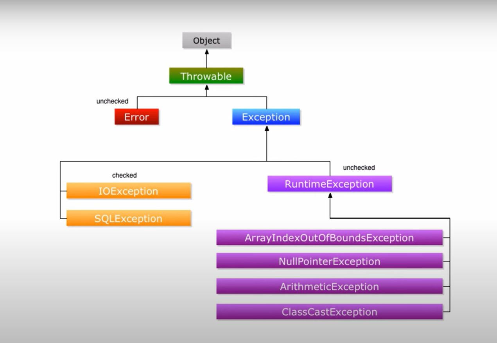

# Aula 09. Exceptions: Try, catch

## Exceptions: try, catch
- Vídeo Aula
- [Vídeo Aula](https://youtu.be/ld2C4GcAtsg)
- Tratamentos de erros no java
- Try e Catch
	try, catch, throw, throws e finlly
- Exemplo de código com erro:
	- Tentamos atribuir um valor no vetor que não existe a posição.
	````java
		int[] vetor = new int[4];
        System.out.println("Antes da Exception");
        vetor[4] = 1;
	````
	- Ao executar, ocorre erro na linha 9, pq esta posição não existe no vetor.
	- Erro:
		Exception in thread "main" java.lang.ArrayIndexOutOfBoundsException: Index 4 out of bounds for length 4
		at com.willian.cursojava.aula47.Excecao.main(Excecao.java:9)
- Para tratar este tipo de erro utilizamos
	- try = tente
	````java
	try{
		//Bloco que é monitorado para erros

	}catch(TipoDaException exception){
		//Tratamento do erro.
	}
	````
	- Tente executar este código e caso ocorra um erro, capture a exceção e trate o erro
- Solução
	````java
		public static void main(String[] args) {
	        try{
	            int[] vetor = new int[4];
	            System.out.println("Antes da Exception");
	            vetor[4] = 1;

	            System.out.println("Este texto nao sera impresso");

	        }catch(ArrayIndexOutOfBoundsException exception){
	            System.out.println("Exceção ao acessar um indice do vetor que não existe");
	        }
	        System.out.println("Este texto sera impresso apos a exception");
	    }
	````
- Não tratar exceções, faz com que o programa termine, tornando o programa meio inoperante.
- Tratando erros, o programa pode executar uma determinada lógica, caso ocorra erro.
- Logo após o erro, o programa continou a ser executado. 

## Exceptions: multiplos catch
- Vídeo Aula
- [Vídeo Aula](https://youtu.be/G8-fhwpHdFU)
- Vamos aprender a pegar diversas exceções ao mesmo tempo.
- Ideia que o programa lançe duas exceções diferentes
- Iremos testar com um vetor que divida números por 0
	````java
		public static void main(String[] args) {
	        int[] numeros = {4, 8, 16,32,64,128 };
	        int[] denominador = {2,0,4,8,0};

	        for(int i=0;i< numeros.length;i++){
	            System.out.println(numeros[1]+ " / " +denominador[i] + " = " + (numeros[i] / denominador[i]));
	            
	        }
	````
	- temos o seguinte erro:
		Exception in thread "main" java.lang.ArithmeticException: / by zero
		at com.willian.cursojava.aula48.MultiploCatch.main(MultiploCatch.java:9)
	- Melhoramos o nosso código fonte com os Try
	````java
		public static void main(String[] args) {
	        int[] numeros = {4, 8, 16,32,64,128 };
	        int[] denominador = {2,0,4,8,0};

	        for(int i=0;i< numeros.length;i++){
	            try{
	                System.out.println(numeros[1]+ " / " +denominador[i] + " = " + (numeros[i] / denominador[i]));
	            }catch (ArithmeticException e1){
	                System.out.println("Erro au dividir por zero");
	            }
	        }
	    }
	````
	- Erro:
		Exception in thread "main" java.lang.ArrayIndexOutOfBoundsException: Index 5 out of bounds for length 5
		at com.willian.cursojava.aula48.MultiploCatch.main(MultiploCatch.java:10)
	- Para tratar isto, temos que tratar vários catch's.
	````java
	try{
		//bloco que é monitorado para erros
	}
	catch(TipoDaException1 exception){
		//tratamento de erro 1
	}
	catch(TipoDaException2 exception){
		//tratamento de erro 2
	}
	````
	- Bloco try, podemos ter um, mas aninhado com vários catch
	- Programa Ajustado
	````java
	public static void main(String[] args) {
        int[] numeros = {4, 8, 16,32,64,128 };
        int[] denominador = {2,0,4,8,0};

        for(int i=0;i< numeros.length;i++){
            try{
                System.out.println(numeros[1]+ " / " +denominador[i] + " = " + (numeros[i] / denominador[i]));
            }catch (ArithmeticException e){
                System.out.println("Erro au dividir por zero");
            }
            catch (ArrayIndexOutOfBoundsException e){
                System.out.println("Posição do Array invalida");
            }
        }
    }
	````
- Se não sabemos o tipo de exceção que vai acontecer, como procedemos?
	- Como capturamois uma exception generica
	````java
	try{
		// Lógica que vamos executar

	}
	catch(Throwable exc){
		//vai pegar uma exceção que não conhecemos
	}
	````
	- Nosso programa ficaria assim:
	````java
		public static void main(String[] args) {
	        int[] numeros = {4, 8, 16,32,64,128 };
	        int[] denominador = {2,0,4,8,0};

	        for(int i=0;i< numeros.length;i++){
	            try{
	                System.out.println(numeros[1]+ " / " +denominador[i] + " = " + (numeros[i] / denominador[i]));
	            }catch (ArithmeticException e){
	                System.out.println("Erro au dividir por zero");
	            }
	            catch (ArrayIndexOutOfBoundsException e){
	                System.out.println("Posição do Array invalida");
	            }
	        }
	    }

	````
- Exitem familias de exceções que vamos ver no futuro
- Multi-Catch de exceptions similiares (Mesma família), um simples exemplo.
	- Exceções similares - somente após o java 7.
	- Exemplo
	````java
	try{
		// Lógica que vamos executar

	}
	catch(ArithmeticException | ArrayIndexOutOfBoundsException exc){
		//vai pegar uma exceção que não conhecemos
	}
	````
	- Como ficaria a nossa solução:
	````java
	public static void main(String[] args) {
        int[] numeros = {4, 8, 16, 32, 64, 128};
        int[] denominador = {2, 0, 4, 8, 0};

        for (int i = 0; i < numeros.length; i++) {
            try {
                System.out.println(numeros[1] + " / " + denominador[i] + " = " + (numeros[i] / denominador[i]));
            } catch (ArithmeticException | ArrayIndexOutOfBoundsException e) {
                System.out.println("Aconteceu um erro");
            }
        }
    }
	````
- Prioridade sempre do catch que foi declarado primeiro
	- Primeiro uma exceção mais especifica
	- Depois uma exceção mais generica
	- As IDE's dao erro caso invertamos.
-  
## Exceptions: finally
- Vídeo Aula
- [Vídeo Aula](https://youtu.be/Xb9rK6L4GYA)
- Finally, palavra erro
	- Exemplo
	````java
	try{
		//bloco que é monitorado para erros
	}
	catch(TipoDaException1 exception){
		//tratamento de erro 1
	}
	catch(TipoDaException2 exception){
		//tratamento de erro 2
	}finally{
		//Executado após o try ou catch
	}

	````
- Exemplos de quando vamos usar
	- Abrir arquivo
	- Realiar leitura
	- Ocorre erro
	- Fecha arquivo no finally
- Exemplo prático
	````java
	public static void main(String[] args) {
        public static void main (String[]args){
            int[] numeros = {4, 8, 16, 32, 64, 128};
            int[] denominador = {2, 0, 4, 8, 0};

            for (int i = 0; i < numeros.length; i++) {
                try {
                    System.out.println(numeros[1] + " / " + denominador[i] + " = " + (numeros[i] / denominador[i]));
                } catch (ArithmeticException e) {
                    System.out.println("Erro au dividir por zero");
                } catch (ArrayIndexOutOfBoundsException e) {
                    System.out.println("Posição do Array invalida");
                }
                finally {
                    System.out.println("Essa linha é impressa sempre após o try ou catch");
                }
            }
        }
    }
	````
- O finally sempre será executado
- Pergunta de entrevista de emprego:
	- Qual a saída do programa abaixo:
	````java
		try {
			System.out.println("numeros[1] + " / " + denominador[i] + " = " + (numeros[i] / denominador[i])");
		} catch (ArithmeticException e) {
			System.out.println("Erro au dividir por zero");
			System.exit(0);
		} catch (ArrayIndexOutOfBoundsException e) {
			System.out.println("Posição do Array invalida");
			System.exit(0);
		}
		finally {
			System.out.println("Terminando o bloco try");
		}
	````
	- System.exit(0);
		- Simplismente termina o catch.

## Exceptions: stacktrace e throws
- Vídeo Aula
- [Vídeo Aula](https://youtu.be/CW7DER5TqLM)
- classe Throwable
	- Mae de todas as exceptions
	- Possúi métodos úteis
	- Os dois mais uteis:
| Método | Descrição|
| --------------- | -------------------------------|
| getMessage()    | Retrona a descrição do erro   |
| printStackTrace | Imprime o stack trace do erro |
- Não usar a throwable, pq ela é a mae de todas as classes. 
- O que fazer neste caso?
	- Usamos Exception
		````java
		//Nao usar isto
		try{

		}catch(Throwable exc){

		}
		//usar isto
		try{

		}catch(Exception exc){

		}		
		`````
- Não colocamos um erro genérico
	````java
	  try{
                    System.out.println(numeros[1]+ " / " +denominador[i] + " = " + (numeros[i] / denominador[i]));
                }catch (Exception e){
                    System.out.println("Erro au dividir por zero");
                }    
	````
	- Colocamos os erros no arquivo de log.
	- Colocamos os erros de forma mais abrangente:
		````java
		catch (Exception e){
                    System.out.println(e.getMessage());
                    e.printStackTrace();
                }
		````
- É sempre importante fazer o controle das exceções no java
	- erro: Resulta na finalização do programa
	- Exception: Possível tratar o erro e continuar exceução do programa
- Palavra chave Throws
	- Usamos quando não queremos tratar a exceção
	- Responsabilidade de quem for usar o método.
- Método pode disparar uma Exception
- Passa a responsabilidade pra quem for utilizar o método
- Exceptions disparadas em tempo de exceução
- (ArrayOutofBounds, Arithmetic) Não necessitam de thros explicitamente
- Util quando voce esta construindo uma API para outros desenvolvedores utilizarem.
- Usamos um metodo com exceção
	````java
	ublic double leNumero() throws Exception {
        Scanner scan = new Scanner(System.in);
        double num = scan.nextDouble();
        return num;
    }
	````
	- Utilizamos da seguinte maneira:
	````java
			public class UsandoThrows {
		    public static void main(String[] args) {

		        System.out.println("Entre com o número decimal");
		        try{
		            double num = leNumero();
		            System.out.println("Voce digitou: " +num);
		        }catch (Exception e){
		            System.out.println("Entrada inválida");
		            e.printStackTrace();
		        }
		    }

		    public static double leNumero() throws Exception {
		        Scanner scan = new Scanner(System.in);
		        double num = scan.nextDouble();
		        return num;
		    }
		}
	````
	- Nunca expomos o erro ao usuário para evitar mostrar pontos chaves do sistema (Tipo, usa linguagem java e assim por diante) Isto pode gerar uma brecha.
	- Mostramos assim: "Entrada Inválida" ao invés de:
		java.util.InputMismatchException
	at java.base/java.util.Scanner.throwFor(Scanner.java:939)
	at java.base/java.util.Scanner.next(Scanner.java:1594)
	at java.base/java.util.Scanner.nextDouble(Scanner.java:2564)
	at com.willian.cursojava.aula50.UsandoThrows.leNumero(UsandoThrows.java:20)
	at com.willian.cursojava.aula50.UsandoThrows.main(UsandoThrows.java:10)

## Exceptions: tipos de erros no Java
- Vídeo Aula
- [Vídeo Aula](https://youtu.be/5R8pw1V2H-g)
- Familias de exceções do java
- Diferença entre erro e exceção no java

- Object, o pai de todas as classes
	- Thrwable, o pai de todos os erros
		- Exception x Erro
		- Um erro acontece em tempo de exceução, e encerra o mesmo.
		- Erro não verificado e nao tem como tratar no java
		- Conseguimos tratar exceptions no java
		- Dois tipos
			- Verificadas
				- mais famosas IOexception e SQLexception. 
					Temos que tratar este tipo de exceção
				- O compilador vai reclamar e pedir para você ja tratar
			- Não verificadas
				- Acontecem em tempo de execução
				- RunTimeExceptions
- Como eu sei o tipo de exception está acontecendo
- [Artigo sobre aprender ingles](https://java.mn/2014/02/23/ler-ingles/)

## Exceptions: criando sua própria exceção
- Vídeo Aula
- [Vídeo Aula](https://youtu.be/Xt0CpwJT5yY)
- Aprender como criar a nossa própria exception no java
- É de boa pratica nos projetos, criar a nossa própria exceção.
- Temos um programa e queremos considerar somente divisões exatas, 
- Sempre que o número for impar, vamos lançar uma exceção.
- Programa abaixo:

	````java
			public class UsandoMinhaException {
		    public static void main(String[] args) {
		        int[] numeros = {4, 8, 5, 16,32,21,64,128 };
		        int[] denominador = {2,0,4,8,0,2,3};

		        for (int i = 0; i < numeros.length; i++) {
		            try {
		                System.out.println(numeros[1] + " / " + denominador[i] + " = " + (numeros[i] / denominador[i]));
		            } catch (ArithmeticException | ArrayIndexOutOfBoundsException e) {
		                System.out.println("Aconteceu um erro");
		            }
		        }
		    }
		}
	````
- Fizemos um ajuste para tratar numero impares na divisão, ja que estamos dividindo números inteiros por números inteiros.
	````java
		 public static void main(String[] args) {
        int[] numeros = {4, 8, 5, 16,32,21,64,128 };
        int[] denominador = {2,0,4,8,0,2,3};

        for (int i = 0; i < numeros.length; i++) {
            try {
                if(numeros[i] %2!=0){
                    //lançar a excpetion aqui
                    throw new Exception("Número impar´, divisão não exata ");
                }
                System.out.println(numeros[1] + " / " + denominador[i] + " = " + (numeros[i] / denominador[i]));
            } catch (ArithmeticException | ArrayIndexOutOfBoundsException e) {
                System.out.println("Aconteceu um erro");
            } catch (Exception e) {
                System.out.println("Aconteceu um erro");
                System.out.println(e.getMessage());

            }
        }
    }

	````
- Em projetos grandes, temos diversos tipos de erros e exceção. 
	- Idela criar a nossa própria exceção.
- Criamos a nossa classe de erro, para tratar divisão de número impar:
	- A classe é extendida de Exception
	`````java
		public class DivisaoNaoExata extends Exception{
	    private int num;
	    private int den;

	    public DivisaoNaoExata(int num, int den){
	        super();
	        this.num = num;
	        this.den = den;
	    }

	    @Override
	    public String toString() {
	        return "Resultado de " + num + "/" + den + "Nao é um inteiro!";
	    }
	}


	``````

## Correção Exercícios Aula 52: Exceptions
- Lista de Exercícios 
- [Link Exercícios](https://youtu.be/tc48uwR9Qto)
- 